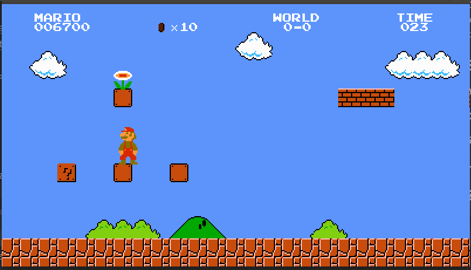
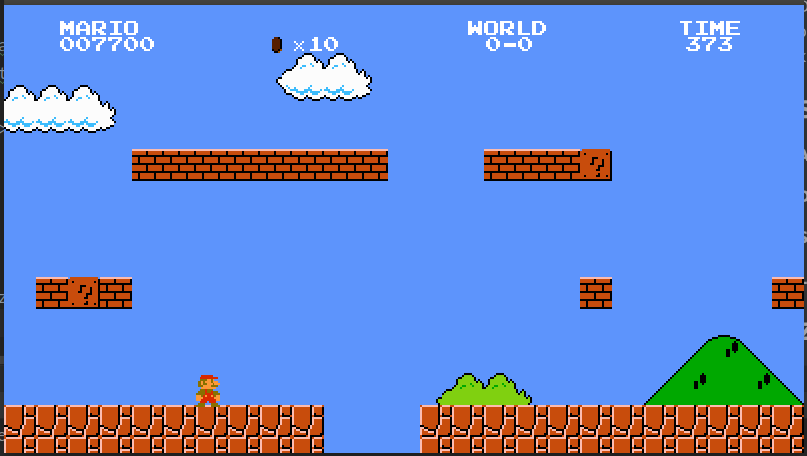
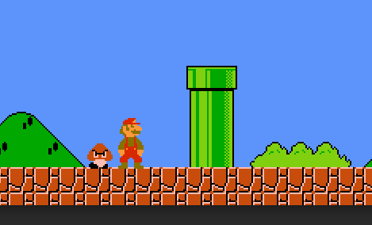
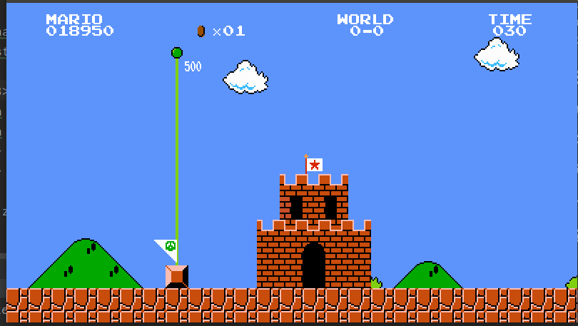

<b>Mario C++ - Maciej Kijko & Marek Kotulski</b>

<h1>Założenia projektu</h1>

  1. Możliwość biegania postacią w lewo i w prawo
  2. Możliwość skakania z saltami
  3. Możliwość zbierania monet
  4. Liczenie punktów
  5. Ograniczenie czasowe 
  6. Pokonywanie przeciwników poprzez naskok lub strzelaniem gdy postać jest w odpowiedniej formie
  7. Możliwość zbierania przedmiotów (grzyby, kwiatki, gwiazdki) które zmieniają forme postaci
  8. Wierne odwzorowanie mechaniki i estetyki z oryginalnej werji Mario

<h1>Wstęp</h1>
Gra przeznaczona dla PC.

<h1>Środowisko</h1>
Gra została napisana w "czystym" C++ w oparciu o bibliotekę wejścia/wyjścia - SDL2.

Do kompilacji gry wymagane jest narzędzie <b>CMake</b> oraz developerskie wersje bibliotek SDL2, SDL2_MIXER, SDL2_IMAGE.
Uruchomienie już skompilowanej wersji, wymaga jedynie standardowych bibliotek C++ oraz powyższych bibliotek przynajmniej 
w wersji dla użytkownika końcowego. 

<h1>Opis aplikacji</h1>
Po uruchomieniu gry zostajemy przeniesieni bezpośrednio do rozgrywki. Większość funkcjonalności
została odwzorowana 1:1 z oryginalej wersji mario tj.

- Skakanie

- Sprint

- Grzybki/Kwiatki/Gwiazdki wzmacniające

- Przeszkody i przeciwnicy

- Zbieranie monet

- Czas na przejście poziomu i punktacja

- Ograniczona liczba żyć

Dodatkową funkcjonalnością odróżniającą naszą grę od oryginału - jest robienie salt przez
naszego protagonistę przy każdym skoku.

<h3>Sterowanie</h3>

<b>A</b> - ruch w lewo 

<b>D</b> - ruch w prawo 

<b>SPACJA</b> - skok 

<b>LSHIFT</b> - sprint oraz strzał 

Zrzuty ekranu z gry

